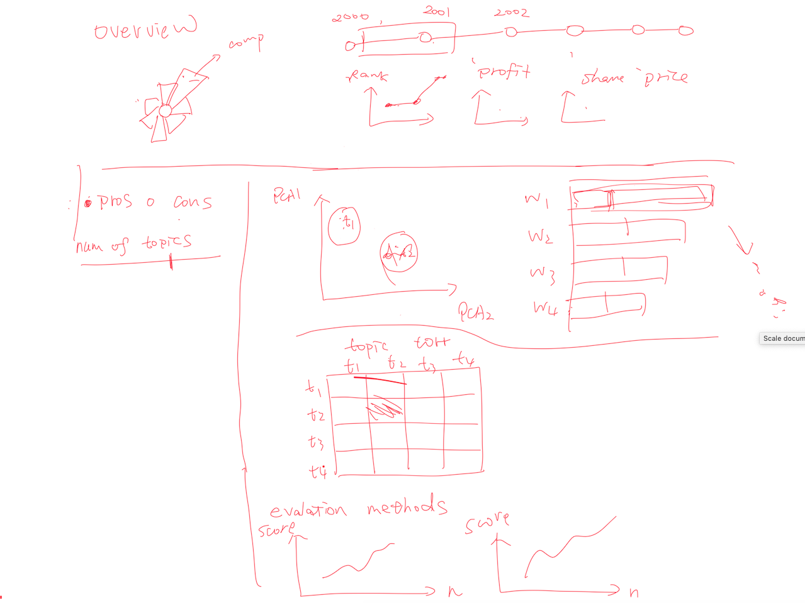
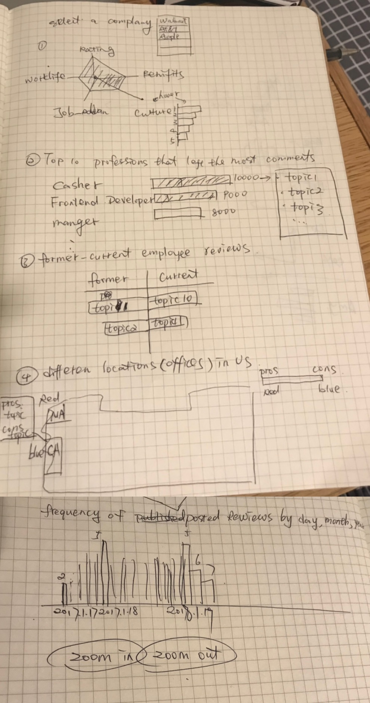
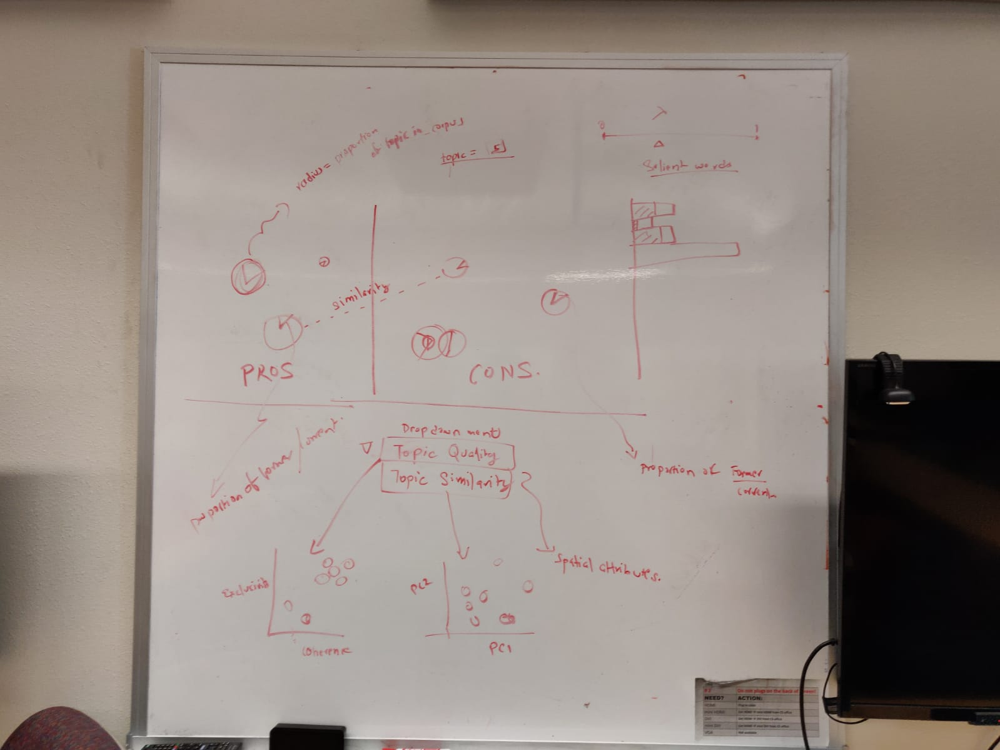
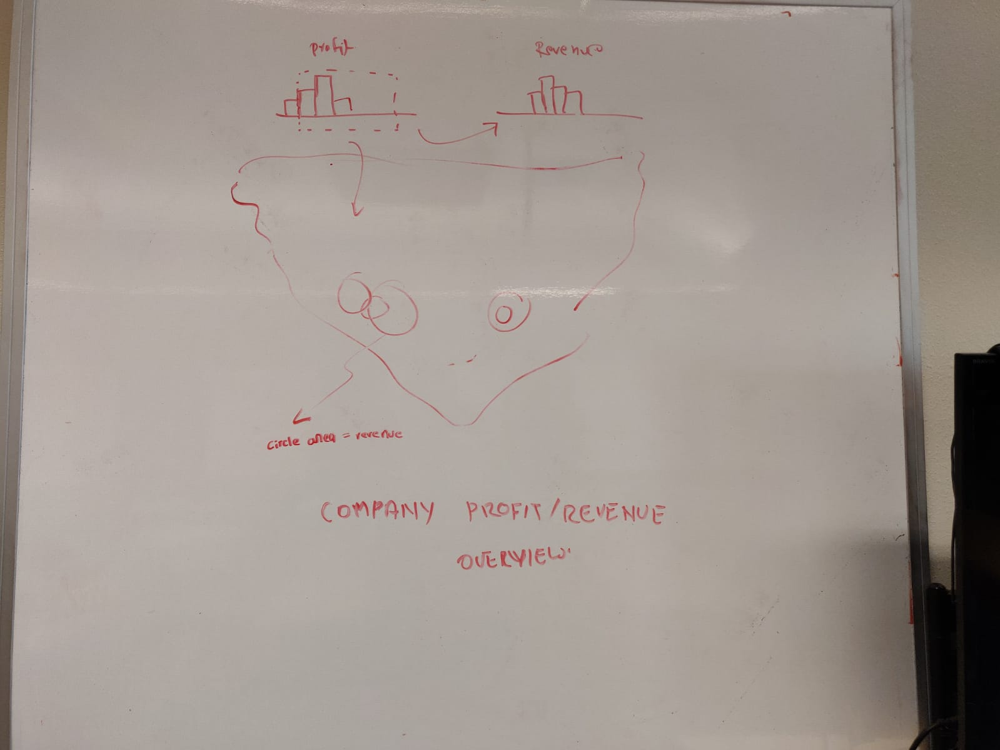
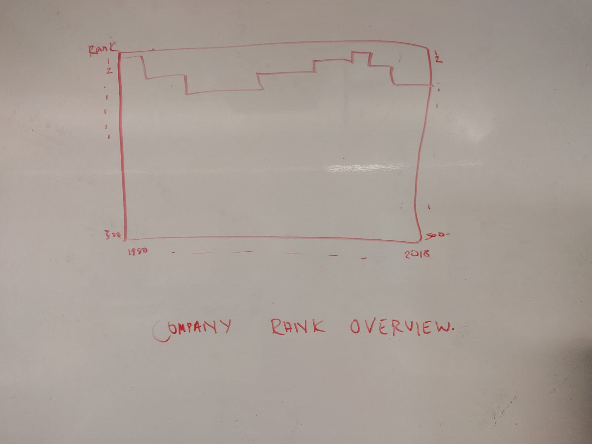
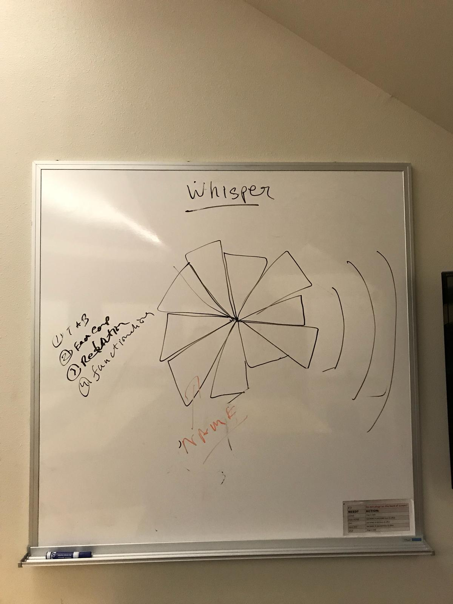
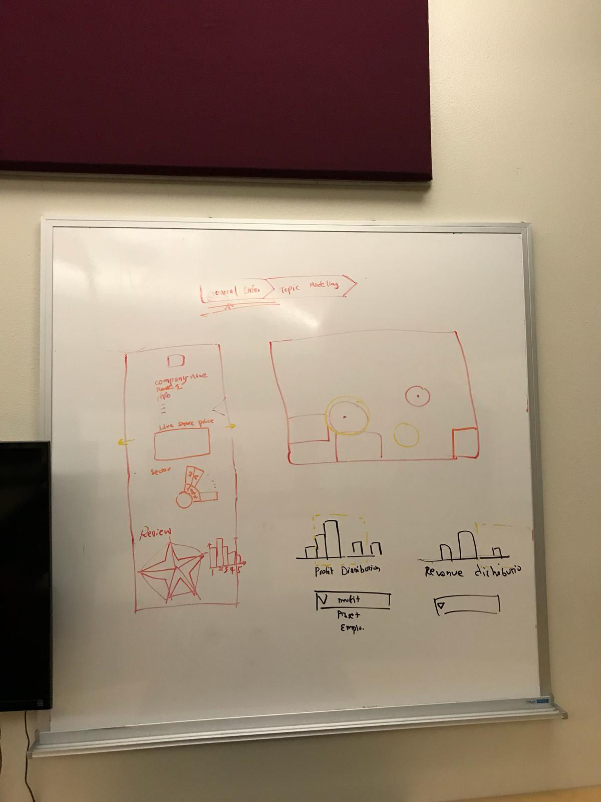
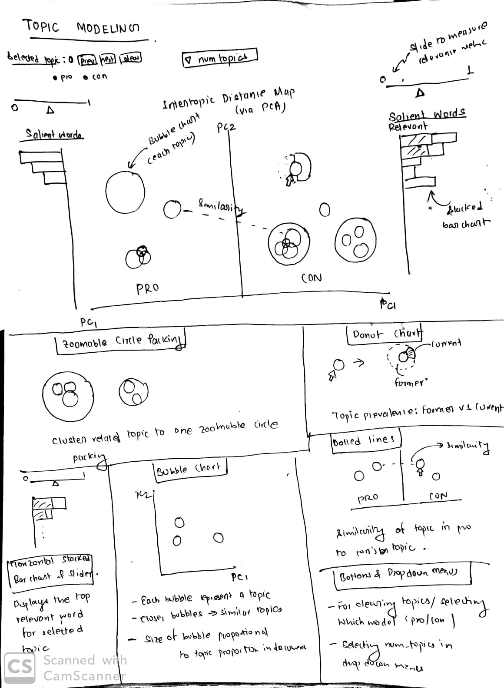

<h1 align="center">Process Book</h1>

<h3>Overall Analysis of Fortune 50 companies and Analysis of Job Satisfaction determinants in Fortune 50 companies using Indeed’s Employee Reviews. 
</h3>

Haixuan Guo, ghaixan95@aggiemail.usu.edu, A02315335 

Bishal Sainju, bsainju@aggiemail.usu.edu, A02290693

Kumar Akshat,  k.akshat@aggiemail.usu.edu, A02314971

<h3>Overview and Motivation</h3>
***Overview*** - The project used data extracted from various platforms and analyse them to provide an insight into what are the key topics that are being discussed among the former and current employees about the companies they worked and are currently working in. The project uses visualization techniques to create an easy to read environment and explain the pro, cons and general information using interactive charts and maps. 

***Motivation*** - The project was made out of the idea where we thought of creating a platform where data can be used to determine the general information about the company and also the various topics being discussed about them. We always see a variety of online platforms where employees discuss about the working life, culture and variety of aspects about companies, they may be former or current employees but they all discuss about their experiences at their companies. Thus we thought of creating a platform for the same, we even used visualization techniques to make the whole project more understandable and easy to analyse.

### Related Work
Online reviews from employees are really helpful for companies discover significant factors that affect employee’ s satisfactions, thus improving their personal management to retain talents.  Review analysis is difficult to process due to the constraints of computation ability and efficient algorithms. However, with the increasing computational power to process big data, and advancement in machine learning models like topic modeling, these are being increasingly efficient to analyze qualitative reviews. Particularly, Professor David M. Blei ‘s paper on LDA applied on text modeling gives us inspiration on exploring topics among employee’s reviews. And professor Carson Sievert’s paper on LDAvis really helps us to visualize and interpret topics.  After some research, we realize that it is also very important to analyze employers, our target audience, whose operation conditions such as profits, ranking, sectors that might have indirect influences on employee’s reviews. 

### Questions
We tends to provide the visualization into the employees’ reviews, the project does represent the data regarding topic modelling and reviews via graphical visualizations. The project also does include topic modeling charts which does represent the various topics clustered as per similarity and documents. The pro and cons topics are described to understand how the employees rate the companies based on various attributes. The reviews also does include on the various attributes which vary from a score of 1 to 5. In summary the project does provide an overview summary for each companies including the basic information, reviews on various attributes and topic wise segregation on the pro and cons via the former and current employees.

In summary the project’s objectives are as follows:

* The project’s audience is the company it refers to.
* Various attributes can be used to compare among the companies, like reviews in various aspects, revenue, profits, employees, offices, and more general information. The comparisons can help us understand how people rate various companies in aspects like culture, work life balance, work breaks and many. Comparisons can also help job seekers to understand reviews and think about the work culture and decide in applying.
* Whisper does provide insight into the general information about the companies, i.e. Share price, revenue, profits, employees, headquarters with a map representation of their offices.
* Ability to compare two companies with each other in terms of general information.
* The ability to compare various attributes in terms of graphs, like profit distribution.
* Various topics segregated under pro and cons and clustered to provide a precise insight of how the topics are related to each other and help companies understand how the correlation and reviews can help understand the internal management and policy changes.
* Visualize the ratio of topics present in documents and sentences.
* How many former and current employees does provide the reviews using those topics in which section, i.e. pro and cons.

 
<h3>Data</h3>
We are collecting our data from Fortune 50 companies site, and Indeed. We will gather information about the company’s rank, their profit and revenues over the year, and company size in terms of employee number and it’s assets, to analyze the basic information about the company, and how their ranking have changed over time.

Similarly, the other part of our project will be focused on finding out aspects of employee satisfaction, and employee turnover determinants from Fortune 50 companies employee reviews on Indeed. So, for this we will collect our data of the employee reviews for each of the Fortune 50 companies.

Fortune 500 (https://fortune.com/fortune500/2019/): 

The Fortune 500 is an annual list compiled and published by Fortune magazine that ranks 500 of the largest United States corporations by total revenues for their respective fiscal years. The list includes publicly held companies, along with privately held companies for which revenues are publicly available.The companies that are included in the survey are those companies that are incorporated in the U.S. and operate in the U.S. and file financial statements with a government agency. 

The site provides various information regarding companies Profit, Revenue, Assets, Total Stockholder Equity and so on. However, for our visualization purpose we will only be using data related to profit, revenue, employee number, and total assets of the company for the fiscal year ended on or before Jan 31, 2019.
 
The information could be scraped from fortune site: “https://fortune.com/fortune500/2019/*/”, where ‘*’ is replaced by company name identifier. Only attributes like ‘Number of Employees’, ‘Revenues’, ‘Revenue Percent Change’, ‘Profits’, ‘Profits Percent Change’, ‘Assets’,  ‘Market Value’, ‘Sector Type’, ‘Industry Type’ will be scrapped for further analysis.. 

Indeed (https://www.indeed.com/):

Indeed is an American worldwide employment-related search engine for job and has the most listing compared to its other competitors (Glassdoor)(https://www.reviews.com/job-sites/). Furthermore, with its easy-to-use user interface, and extensive features, it has become one of the best platforms for the employee’s to express their opinions regarding the companies that they work for (current employee) or that they previously worked for (former employee). Moreover, Indeed has one of the highest counts of the number of reviews available, which are readily served for analysis. That’s why, Indeed’s employee reviews was used for the purpose of our analysis for figuring out latent determinants for employee satisfaction. 

It was legal to scrape “https://www.indeed.com/cmp/*/reviews”. So, the companies reviews was scraped using this URL, replacing ‘*’ with the company name that indeed used in its site for company reviews. Only 50 companies of Fortune 50 companies was used for our job satisfaction analysis purpose. For our analysis purpose, only the attributes like “Review Title”, “Reviewer Job Status”, “Review Text”,  “Pros Texts”, “Cons Texts”, “Ratings” was scraped. 

### Data Cleanup and Processing: 

Each Indeed’s reviews have specific section regarding “Pros” and “Cons” of a company, where employees can provide specific reviews regarding the positives and negatives of a company, thus allowing us to explore these 2 domains for finding out employee satisfaction aspects. For this project, we used only these 2 reviews for our analysis purpose. We used (Latent Dirichlet Allocation) LDA and (Structural Topic Modeling) STM as Topic Modeling framework to explore the latent topics in these reviews. 

We first combined all the pros and cons reviews from all of the Fortune 50 companies, and sampled at most 1000 reviews from each company so that one companies satisfaction aspect does not dominate the general model. We then performed various text preprocessing like: text cleaning, stopwords removal, stemming and so on to normalize the texts for the next stage. 
Then we tokenized each of the terms, and created bigrams and trigrams, and added those terms as well in our corpus. 

After building the corpus, we trained it with LDA and STM models. LDA is a generative statistical model that allows sets of documents to be explained by random mixtures over latent topics, where each topic is characterized by a distribution over words. STM is similar to LDA, however, it also provides general way to incorporate document level covariates (in our case Employee Status : Former or Current), that affects the topical prevalence or topical content.

Using these models, we extracted 2 matrices: topic-term distribution, and document-topic distribution. Since we wanted to visualize the topics in 2 dimensions, we needed the information about their spatial position, for which, we reduced the topic term distribution to 2D using PCA algorithm. We used Jensen-Shanon divergence to compute 

the difference between various topics.  Jensen–Shannon divergence is a method of measuring the similarity between two probability distributions in probability theory and statistics. We used topic term distribution matrix for applying PCA, where each topic is a record and each of those topics are represented with the BOW’s term vectors. And we analyze the similarities between topics using these vectors. So with PCA we got the coordinates of each topic circles. We also need the information about frequent words in the topics, and we calculated that using FREX algorithm. 

So, this basically calculates the relevance of a particular term in the topic on the basis of the lambda value that the user fixes on the slider, that we will have on our visualization. Setting lambda = 1 results in the familiar ranking of terms in decreasing order of their topic-specific probability, and setting lambda = 0 ranks terms solely by their lift, meaning that the rare terms of the topic are given more weight, which can be inferred as second term in equation is divided by total probability of the word in the whole corpus. We wish to learn an “optimal” value of for topic interpretation from our visualization.

Relevance is calculated at the run time, when users sets it to one particular value, whereas the other components like P(w) is required and calculated. For this project, we are using topic = 10 for both “pro” model and “con” model, right now. However, we might tweak this value as suitability. Similarly, P( w | t) can be found from document term matrix. So, we preprocess it in easy to use format for visualization. 

Similarly for the bubble size, which represents the topic proportion in the whole corpus, we use the document term matrix, and calculate the topic proportion for the whole document by summing the gamma values in the document term matrix.

We will also need the information of topic proportion, and also its prevalence over former and current employee covariate.

Right now, these are the only data that we required for the prototype model of the visualization, so we only processed these data. Similarly the next phase will be required to incorporate Job Status information, for which we will require the proportion of topic in Former and Current employees, which we will do it later. 

And also we will need to derive ways to find similarities between topics of 2 different models (“pros” and “cons”), to be able to link them in our visualization. 

### Exploratory Data Analysis
So, basically we used distribution plot on seaborn  to analyze the distribution of the terms for feeding those terms on the Topic Modeling algorithm. We did this as a text pre processing step for building the model. 

### Design Evolution

There are two main aspects we want to present in our project - general information of companies and topic modeling. In general information section, some financial factors that indirectly affect employees’ satisfactions are included such as companies’ profits, revenues and share prices. In topic modeling section, we will show topics from pros model and cons model respectively, as well as key words in each topic.

Here are three alternative design sketches. 

<h5>Vis1</h5>
<!---->

Advantages: Basically it shows all the information we want to display 

Disadvantages: There is not enough time series data by year.  
<h5>Vis2</h5>

Advantages: broaden the topic by taking professions and working locations into account

Disadvantages: it is hard to implement some of the ideas because of data accessibility.
<h5>Vis3</h5>

Advantages:  some interesting and diverse charts

Disadvantages: a little bit weak connection in two aspects.

<h5>Final design</h5>

The design will be the one to load at first as the project loads up. The radial chart will load slowly showing the project it loading, with each part loading in few milliseconds, as the whole chart completes and the circle is complete, the Whisper project loads up and the signal three bars show up showing a signal. Then the whole chart does of and the general information tag comes up on the screen.

In this view, we will show the geographical distribution of Fortune 50 companies in the US. Circle size on the map encodes company’s revenue. On the left, we will use line chart to show daily share price, and a hierarchical zoomable sunburst diagram to show the sector and industry which each company belongs to. Furthermore, a radar chart is designed to show average scores of five covariates like work life, benefits(1-5). When hovering on one covariate, a histogram that shows the frequency of the covariate from one score to five scores. 

Topic Modeling: 

For this visualization we will basically be using different visual encodings like Zoomable Circle Packing, Stacked bar charts, Bubble Charts and Donut Charts. We will also use various controllers like buttons, radio button, text box, drag down menu and slider. We will also enable interaction between various components.

So, the main aspect of this visualization is to show the several topics in our models for pro and con, to one spatial space. We will utilize the spatial position attribute to cluster similar topics together. This will basically be a bubble chart with each bubble being one single topic, with the proximity between the bubbles representing similarity between those topics, while distant bubbles are very different topics. And with the size of bubble we aim to encode the proportion of this particular topic in the whole corpus. We will also use zoomable circle packing to cluster similar topics together, in order to remove the clutter and make our visualizations much more cleaner. On clicking any of the circle packing (which contains clusters of other topics), it will zoom in to display to show topics within it, and on clicking any of these circles will display the most relevant words for that topic, adjusted using the slider on the side for relevancy metric. Also on clicking one circle we will highlight only that circle and gray out all other circles, and also highlight the similar topic in another model ie. if we click on food related topic on “pro” model we aim to connect it to food related topic on “con” model using dotted line and also display weight on it. Also on clicking on any topic will expand it to a donut chart showing the proportion of this topic among former and current employees, helping us identify where this topic is more prevalent in, either the former or current employee. Similarly buttons, drag down menus, radio buttons will be added for control over what we will display. 

### Must-Have Features ###
* Sunburst chart that shows revenues of companies
* US map that shows the geographical distribution of all the companies, circles whose size shows the revenue of companies, and interaction with company’s profile.
* Company profile including profits, revenue, share price, and 5 basic measurements of employee’s satisfaction such as work-life, rating, benefits and so on.
* Pros and cons topic circles that shows topic prevalence and similarity, and corresponding stacked bar chart that shows word distribution in documents.
* A bigger circle that clusters topics with high similarity , zoom in to see specific topics and zoom out to see overview.
* Pie charts to compare prevalence of topics among former employees with that among current employees.
* A track bar to select the number of topics for modeling.
### Optional Features ###
* Comparison of two companies’ profiles
* Document Clustering
* Company Rank change over the years

<h3>Project Schedule</h3>

Week |Bishal|Haixuan|Akshat
----|---|---|---
Nov 10 - Nov 16|Obtain data|Build basic structures such as html and classes|Build basic structures such as html and classes
Nov 17 - Nov 23|Topic modeling|General info-map|Sunburst chart
Nov 24 - Nov 30|
Topic modeling (continue)
Test our demo|
General info-profits and revenue bar charts 
Test our demo| 
General info-profile
 Test our demo
Dec 1 - Dec 7|Finish process book and Prepare for the presentation|Finish process book and Prepare for the presentation|Finish process book and Prepare for the presentation

